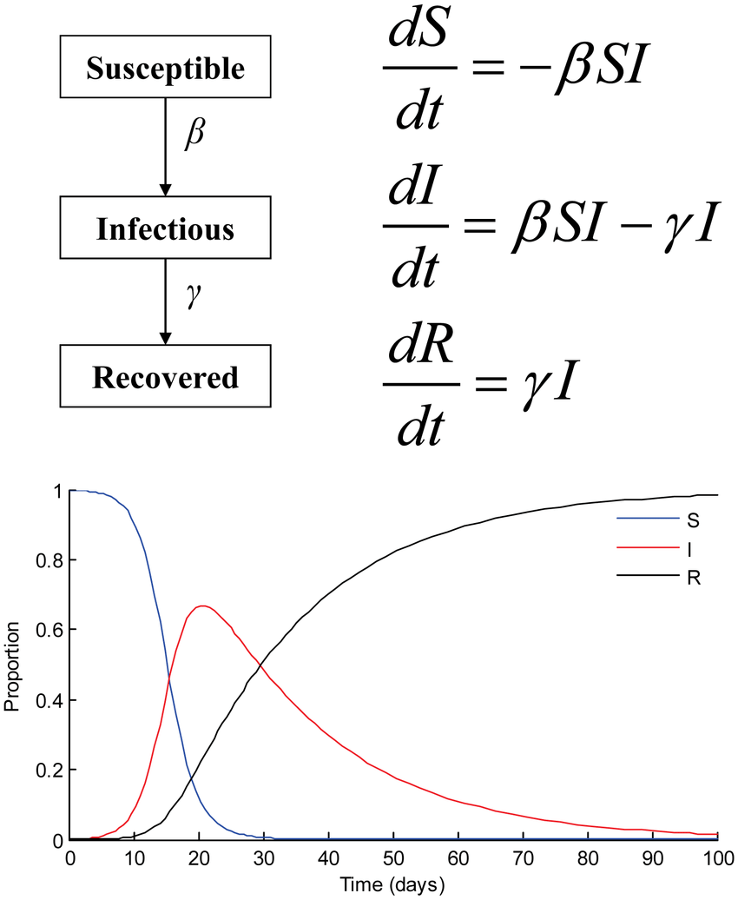
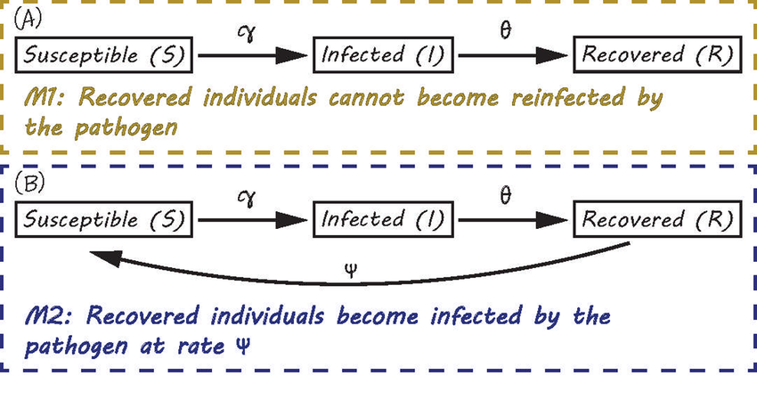

# SIR Epidemic Simulation & Machine Learning

## Modeling and Simulation Mini Project | Predictive Analytics Assignment-6

---

## 📌 Project Overview

This project demonstrates data generation using modeling and simulation to create a synthetic dataset for machine learning.

We simulate epidemic outbreaks using the classical **SIR (Susceptible–Infected–Recovered)** model and train multiple machine learning models to predict outbreak severity based on initial epidemiological parameters.

The objective is to:
- Generate 1000 simulation samples
- Build a synthetic dataset
- Train multiple ML classifiers
- Compare models using evaluation metrics
- Identify the best performing model

---

## 🧠 Simulation Model – SIR





The SIR model is governed by the following differential equations:

dS/dt = -β(SI/N)  
dI/dt = β(SI/N) - γI  
dR/dt = γI  

Where:

- **S** → Susceptible population  
- **I** → Infected population  
- **R** → Recovered population  
- **β** → Infection rate  
- **γ** → Recovery rate  
- **N** → Total population  

The simulation generates epidemic curves for different combinations of β and γ.

---

## 📂 Project Structure

```
Data_generation_using_modeling_simulation_assign6/
│
├── data/
│   └── sir_dataset.csv
│
├── results/
│   ├── model_comparison.csv
│   └── best_model.csv
│
├── src/
│   ├── simulation.py
│   ├── dataset_builder.py
│   ├── train_models.py
│   └── run_pipeline.py
│
├── requirements.txt
├── .gitignore
└── README.md
```

---

## ⚙️ Installation

Install required packages:

```
pip install -r requirements.txt
```

---

## 🚀 How to Run

From inside the `src` folder:

```
python run_pipeline.py
```

This will:

1. Generate 1000 epidemic simulations  
2. Create a synthetic dataset  
3. Train 8 classification models  
4. Evaluate models  
5. Save results inside the `results/` folder  

---

| Model  | Accuracy | Precision | Recall | F1_Score | ROC_AUC | Train_Time_sec | Rank |
|-----------|----------|-----------|--------|----------|----------|----------------|------|
| Random Forest ⭐  | 1.0 | 1.0 | 1.0 | 1.0 | 1.0 | 0.092 | 1 |
| Gradient Boosting | 0.995 | 0.973 | 1.0 | 0.9863 | 1.0 | 0.100 | 2 |
| Decision Tree | 0.995 | 0.973 | 1.0 | 0.9863 | 0.997 | 0.003 | 3 |
| KNN (k=5) | 0.995 | 0.973 | 1.0 | 0.9863 | 0.9997 | 0.005 | 4 |
| Logistic Regression | 0.995 | 1.0 | 0.9722 | 0.9859 | 1.0 | 0.005 | 5 |
| AdaBoost | 0.985 | 0.9714 | 0.9444 | 0.9577 | 0.9993 | 0.104 | 6 |
| SVM (RBF) | 0.985 | 1.0 | 0.9167 | 0.9565 | 0.999 | 0.012 | 7 |
| Naive Bayes | 0.945 | 0.931 | 0.75 | 0.8308 | 0.9929 | 0.002 | 8 |

---

## 📊 Dataset Description

Each simulation generates the following features:

| Feature | Description |
|----------|------------|
| beta | Infection rate |
| gamma | Recovery rate |
| initial_infected | Initially infected individuals |
| peak_infected | Maximum infected during outbreak |
| time_to_peak | Time to reach peak infection |
| total_infected | Total infected at end |
| severity | 0 = Mild outbreak, 1 = Severe outbreak |

For model training, only initial parameters (beta, gamma, initial_infected) are used to avoid data leakage.

---

## 🤖 Machine Learning Models Used

The following classification models were evaluated:

- Random Forest
- Gradient Boosting
- AdaBoost
- SVM (RBF Kernel)
- K-Nearest Neighbors (k=5)
- Logistic Regression
- Decision Tree
- Naive Bayes

---

## 📈 Evaluation Metrics

Models were evaluated using:

- Accuracy
- Precision
- Recall
- F1 Score
- ROC-AUC

Models are ranked using integer ranking based on F1 Score.

---

## 📁 Output Files

After execution, the following files are generated:

- `results/model_comparison.csv` → Full comparison table  
- `results/best_model.csv` → Best performing model  

---

## 🏆 Conclusion

This project demonstrates how simulation-based synthetic data can be used to train and compare multiple machine learning models.  

The best model is selected based on F1 Score, ensuring balanced classification performance for epidemic severity prediction.

---

## 📌 Author

- Kaavya Dhir
- 102317251

---


